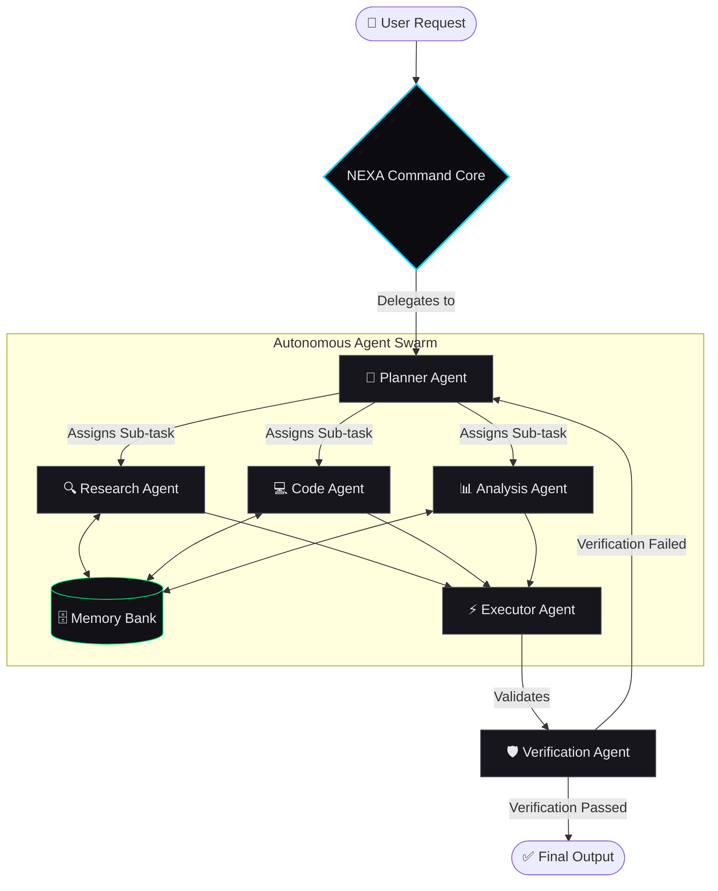

<h1 align="center">NEXA — Agentic AI</h1>

<p align="center">
  
</p>

<p align="center">
  NEXA is a premium, futuristic Agentic AI platform interface. It is designed to act as an operating system where users can create autonomous AI agents that understand goals, plan tasks, use tools, execute actions, and report results.
</p>

<p align="center">
  
  
  
  
</p>

---

## 🏗️ System Architecture

NEXA's Multi-Agent architecture is designed to orchestrate complex tasks through specialized autonomous agents.



## ✨ Features

- 🧠 **Agent Command Core**: Interactive network visualization of orbital agent nodes.
- 🎛️ **Agent Dashboard**: A real-time command center workspace to orchestrate autonomous agents.
- 🛠️ **Agent Builder**: Configure capabilities, assign tools, and deploy agents instantly.
- 🔀 **Workflow Canvas**: Visually design complex multi-step pipelines with connected nodes.
- ⚡ **Multi-Agent Runtime**: Display active agent clusters (Researcher, Planner, Coder, Analyst, Executor).
- 🔌 **Tool Ecosystem**: Integration grids showing connected services (GitHub, Slack, Databases, APIs).
- 📈 **Real-Time Monitoring**: Live activity timeline tracking agent reasoning, extraction, and validation.

## 🚀 Technology Stack

- **Framework**: [Next.js 15](https://nextjs.org/) (App Router, React 19)
- **Language**: [TypeScript](https://www.typescriptlang.org/)
- **Styling**: [Tailwind CSS v4](https://tailwindcss.com/)
- **Animations**: [Framer Motion](https://www.framer.com/motion/)
- **Icons**: [Lucide React](https://lucide.dev/)

## 🎨 UI/UX Design Principles

- **Premium & Futuristic**: Deep black/near-black backgrounds with sophisticated cyan accents.
- **Glassmorphism**: Subtle ambient glows and frosted glass panels.
- **Micro-Interactions**: Magnetic CTA buttons, scroll reveals, data flow particles, and pulse animations.
- **Typography**: Clean, robust hierarchy powered by the *Geist* sans-serif font.

## 📦 Installation

To run this project locally, follow these steps:

1. **Clone the repository:**
   ```bash
   git clone https://github.com/gpsaarvin/Agentic-Ai-.git
   cd Agentic-Ai-/nexa-app
   ```

2. **Install dependencies:**
   ```bash
   npm install
   ```

3. **Start the development server:**
   ```bash
   npm run dev
   ```

4. **View the application:**
   Open your browser and navigate to [http://localhost:3000](http://localhost:3000).

## 📁 Project Structure

```text
src/
├── app/                  # Next.js app router & global layouts
│   ├── globals.css       # Global theme, variables & custom keyframes
│   ├── layout.tsx        # Root layout with font configuration
│   └── page.tsx          # Main assembly page
├── components/           # Reusable UI components
│   ├── agents/           # Agent Builder & Multi-Agent UI
│   ├── dashboard/        # Command Center Dashboard
│   ├── landing/          # Hero, Navbar, Tools, Metrics, Timeline, Pricing
│   └── workflows/        # Workflow Canvas Engine
└── lib/                  # Utilities (e.g., classname merger)
```

## 📄 License

This project is open-source and available under the [MIT License](LICENSE).

---
<p align="center"><i>Built for the agentic era.</i></p>
